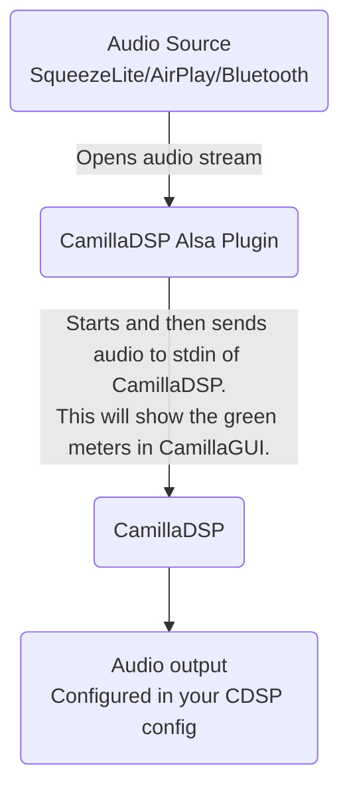

# piCoreCDSP
The goal of this project is to provide an easy way to install [CamillaDSP](https://github.com/HEnquist/camilladsp) 3.0.0 including [GUI](https://github.com/HEnquist/camillagui-backend) 3.0.2
and automatic samplerate switching on a [piCorePlayer](https://www.picoreplayer.org/) installation.

## Requirements
- a fresh piCorePlayer 10.0.0 or 9.2.0 installation without any modifications
- on an armv7 or arch64 compatible device (Raspi 2/3/4/5)

## How to install
1. Select a valid output for your Raspi in `Squeezelite Settings > Audio output device settings`.
   Check [here](#squeezelite-doesnt-start-even-though-it-is-set-to-auto-start) for more info.
2. Increase piCorePlayer SD Card size to at least 200MB via `Main Page > Additional functions > Resize FS`
3. Run `install_cdsp.sh` on piCorePlayer from a terminal:
   - SSH onto the piCorePlayer as user `tc`
     - Usually `ssh tc@pcp.local` or `ssh tc@<IP of your piCorePlayer>`
     - [How to find the IP address of your piCorePlayer](https://docs.picoreplayer.org/how-to/determine_your_pcp_ip_address/)
   - Run  
     `wget https://github.com/JWahle/piCoreCDSP/raw/main/install_cdsp.sh && chmod u+x install_cdsp.sh && ./install_cdsp.sh`
   - Or if you want to run a modified version of the script or an older version, see the [For developers and tinkerers](#for-developers-and-tinkerers) section
4. Open CamillaGUI in the browser:
   - It will be running on port 5000 of piCorePlayer.  
     Usually can be opened via [pcp.local:5000](http://pcp.local:5000) or `<IP of your piCorePlayer>:5000`
   - Under `Playback device` enter the settings for your DAC
     (by default a dummy output `null` is used, so you can see that CamillaDSP is technically working)
     - These HAVE TO BE CORRECT, otherwise CamillaDSP and Squeezelite won't start!
       - `device`: The Alsa device name of the DAC
         - A list of available devices can be found in `Squeezelite settings > Output setting`
         - If you know the `sampleformat` for your DAC or want to find it through trial and error,
           then choose a device with `hw:` prefix. Otherwise, use one with `plughw:` prefix.
       - `channels`: a supported channel count for the DAC  
         Usually 2 for a stereo DAC.
       - `sampleformat`: a supported sample format for the DAC. (Only important, when NOT using a `plughw:` device)
   - Hit `Apply and save`
     - You should see channel meters and `State: RUNNING` on the left
     - If things go wrong, check the CamillaDSP log file via the `Show log file` button for more info.
       After changing the settings, go to the pCP `Main Page` and press `Restart` to restart Squeezelite.
       If the settings are correct, the channel meters and `State: RUNNING` on the left side should be visible in CamillaGUI.

## Troubleshooting

### The script fails with an error

#### Just try again
Check, your system meets all the requirements, reboot and try to install again.

Sometimes, the script's dependencies get corrupted while downloading.  
In that case, you'll see messages like this somewhere in the log:  
`Checking MD5 of: openssl.tcz.....FAIL`  
There are a couple of things, you can try to work around this:
1. reboot and try to install again, repeat until successful
2. You can try to switch the extension repo:  
   - Reboot, then go to Main Page > Extensions > wait for the check to complete (until you see 5 green check marks)  
   - Then go to Available > Current repository > select "piCorePlayer mirror repository" and "Set".  
   - Run the script again.

If the error persists, post the error message on the piCoreCDSP Thread on
[diyaudio.com](https://www.diyaudio.com/community/threads/camilladsp-for-picoreplayer.402255/)
or [lyrion.org](https://forums.lyrion.org/forum/user-forums/linux-unix/1646681-camilladsp-for-picoreplayer).

#### Enough RAM?
If you have a Raspberry Pi with less than 1 GB of RAM, you might need to increase the swap partition to at least 512MB.

### Squeezelite doesn't start, even though it is set to auto start
piCorePlayer has a little special logic to determine whether it will start Squeezelite on boot. Here is how to get it to work.  
In `Squeezelite Settings > Audio output device settings` select a valid output for your Raspi.
If you have a supported DAC head installed, select that. Otherwise:
- for Raspi zero, 400, 5 or compute module use one of the HDMI options
- for the other Raspi models select `Headphones`

**It is irrelevant whether that is the output you are actually using.**  
If you do this after installing piCoreCDSP, you have to manually set the audio output back to `camilladsp` for Squeezelite, AirPlay and Bluetooth.

### Squeezelite is running, but CamillaDSP is offline (State: Offline)
Make sure in `Squeezelite Settings > Change Squeezelite settings` the following is set:  
`Output setting` is set to `camilladsp`  
`Close output setting` is empty or set to 0

### The audio is delayed
There are various buffers, which can be decreased to reduce latency.
This might reduce stability, so decrease stepwise and try which settings work for your setup.
`Squeezelite Settings > Change Squeezelite settings > ALSA setting` the first number can be decreased to 0  
`CamillaDSP > Devices > Buffers > queuelimit` can be reduced to 1  
`CamillaDSP > Devices > Buffers > chunksize` can be reduced - just keep multiples of 2  


## How to update to CamillaDSP 3.0.0
You can update to the current version, if you have PCP 9.x installed.
For older PCP versions, updating is difficult and not recommended - just do a fresh install and enjoy life.

To update, you have to:
- [remove the piCoreCDSP extension](#picorecdsp-extension)
- [remove the installation script](#picorecdsp-installation-script)
- [install the new version](#how-to-install)
- Update your CamillaDSP config files in the GUI at [pcp.local:5000](http://pcp.local:5000)
  - go to the `Files` tab
  - press "New config from default"
  - press "Import config"
  - select the config you want to update
  - select all checkboxes
  - press "Import"
  - save the config
  - the newly saved config should show as

### How to update to PCP 10.0.0
You can do the insitu update, but afterward you have to reinstall piCoreCDSP and activate your old configuration in CamillaDSP.

## How to uninstall
SSH onto the piCorePlayer and enter the following commands depending on what you want to uninstall.

### piCoreCDSP extension
If you want to uninstall without setting up piCorePlayer again,
you have to reconfigure your audio output device in the pCP UI.
Then uninstall the piCoreCDSP Extension
(In `Main Page > Extensions > Installed >` select `piCoreCDSP.tcz`, press `Delete`)
and reboot.

### piCoreCDSP installation script
`rm -f /home/tc/install_cdsp.sh`

### CamillaDSP sound device
Remove the `pcm.camilladsp` entry from `/etc/asound.conf`.
This is easy to do with the Nano text editor:
```shell
tce-load -wil -t /tmp nano
nano /etc/asound.conf
```

### CamillaDSP configuration files and filters
`rm -rf /etc/sysconfig/tcedir/camilladsp/`

### Save the changes
If you just restart, some changes will not be persistent. To make all your changes persistent, run:
`pcp backup`

## Implementation
The `install_cdsp.sh` script downloads the following projects including dependencies
and installs them with convenient default settings:
- https://github.com/spfenwick/alsa_cdsp (forked from https://github.com/scripple/alsa_cdsp)
- https://github.com/HEnquist/camilladsp
- https://github.com/HEnquist/camillagui-backend

### Audio Architecture


## For developers and tinkerers

In this section it is assumed, that your piCorePlayer is available on [pcp.local](http://pcp.local).
If this is not the case, replace occurrences of `pcp.local` with the IP-address/hostname of your piCorePlayer.

### Modifying the installation script
If you made some changes to the installation script on your local machine and want to run it quickly on the piCorePlayer, 
run the following command from the location of the script:  
```shell
scp install_cdsp.sh tc@pcp.local:~ && ssh tc@pcp.local "./install_cdsp.sh"
```

### Keeping downloaded extensions to reduce re-installation time
You can keep downloaded extensions to skip the download when installing again.
The extensions won't be loaded on startup, so startup time should not be impacted.
Just call the script with the `-k` or `--keep-downloads` parameter. 

### Running your own python scripts
You can run python scripts requiring `pycamilladsp` or `pycamilladsp-plot` like this:
1. Copy your script from your local machine to pCP: `scp <your_script> tc@pcp.local:~`
2. In `Tweaks > User Commands` set one of the commands to this:  
   `sudo -u tc sh -c 'source /usr/local/camillagui/environment/bin/activate; python3 -u /home/tc/<your_script> > /tmp/<your_logfile> 2>&1'`
3. Save and reboot

If you need to access files in your script, make sure to use absolute paths.
In case this environment is missing some dependencies for your script,
you can create an environment with custom dependencies using https://github.com/JWahle/piCorePython.

### Running CamillaDSP standalone

You can run CamillaDSP standalone. This might be useful, if you want to capture audio from some audio device.
Although, in this case you won't be able to use any of the Squeezelite/airPlay/Bluetooth audio sources.

1. Go to `Tweaks > Audio Tweaks` and set `Squeezelite` to `no`.
2. Then go to `Tweaks > User commands` and set one of the commands to  
   `sudo -u tc sh -c '/usr/local/camilladsp -p 1234 -a 0.0.0.0 -o /tmp/camilladsp.log --statefile /mnt/mmcblk0p2/tce/camilladsp/camilladsp_statefile.yml'`  
   or if you want a fixed volume of e.g. -30dB after boot, use this command:  
   `sudo -u tc sh -c '/usr/local/camilladsp -p 1234 -a 0.0.0.0 -o /tmp/camilladsp.log --statefile /mnt/mmcblk0p2/tce/camilladsp/camilladsp_statefile.yml --gain=-30'`
3. Save and reboot
